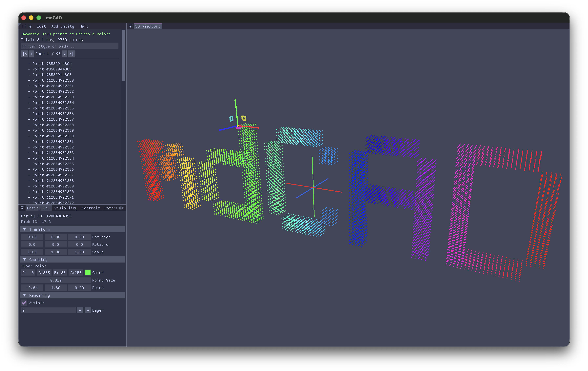

# mdCAD

A lightweight, cross-platform CAD viewer and geometry editor built with C, ECS architecture, and GPU-accelerated rendering; recent milestones shipped deterministic sketch-solver robustness, script re-apply fidelity, and observable JSONL-as-sketch import with transactional live reparse workflows.



## Features

- **Geometry primitives**: Points, lines, polylines, arcs, polygons, Bezier curves, helices
- **Point cloud import**: PLY and JSONL geometry log importers with progress tracking
- **Entity-Component-System**: Flecs ECS for scene management with parent-child hierarchies
- **GPU rendering**: Sokol graphics backend (Metal, D3D11, Vulkan, OpenGL, WebGL)
- **Interactive UI**: Dear ImGui interface with scene hierarchy, property inspector, search/filter
- **Editing tools**: Undo/redo, drag-and-drop reparenting, multi-select, translation gizmo
- **Serialization**: Save/load scenes to JSON
- **Cross-platform**: macOS, Windows, Linux, iOS, Android, Web (Emscripten)

## Quick Start

**macOS (Ninja):**
```bash
cmake -B build -G Ninja && ninja -C build
./build/bin/mdCAD
```

**Windows (MSVC + Vulkan):**
```powershell
cmake -B build-vulkan -G "Visual Studio 18" -DUSE_VULKAN=ON; cmake --build build-vulkan --config Release
.\build-vulkan\bin\Release\mdCAD.exe
```

**Web (Emscripten):**
```bash
emcmake cmake -B build-web && cmake --build build-web
open build-web/bin/mdCAD.html
```

See [docs/QUICKSTART.md](docs/QUICKSTART.md) for full build instructions including iOS, Android, and MinGW configurations.

## Platform Support

| Platform | Backend | Status |
|----------|---------|--------|
| macOS | Metal | Supported |
| Windows | D3D11 / Vulkan | Supported |
| Linux | OpenGL | Supported |
| Web | WebGL2 | Experimental |
| iOS | Metal | Experimental |
| Android | GLES3 | Experimental |

## Architecture

mdCAD uses an **Entity-Component-System** (Flecs) for scene management, **Sokol** for cross-platform GPU rendering, and **Dear ImGui** (via cimgui) for the user interface. All modules are header-only C with `static inline` functions.

See [docs/ECS_RENDERING_PRIMER.md](docs/ECS_RENDERING.md) for a detailed architecture overview.

## Third-Party Libraries

| Library | License | URL |
|---------|---------|-----|
| Sokol | zlib/libpng | https://github.com/floooh/sokol |
| Dear ImGui | MIT | https://github.com/ocornut/imgui |
| cimgui | MIT | https://github.com/cimgui/cimgui |
| Flecs | MIT | https://github.com/SanderMertens/flecs |
| cJSON | MIT | https://github.com/DaveGamble/cJSON |

See [THIRD_PARTY_LICENSES.md](THIRD_PARTY_LICENSES.md) for full license texts.

## License

MIT License. See [LICENSE](LICENSE) for details.
