# ECS Rendering System Primer

A comprehensive guide to understanding the Entity Component System (ECS) and GPU-instanced rendering architecture.

## Table of Contents

1. [Architecture Overview](#architecture-overview)
2. [Component Design](#component-design)
3. [GPU Buffer Management](#gpu-buffer-management)
4. [Memory Layout](#memory-layout)
5. [Slot Allocation Strategy](#slot-allocation-strategy)
6. [Dirty Flag System](#dirty-flag-system)
7. [Rendering Pipeline](#rendering-pipeline)
8. [Examples: Entity Lifecycle](#examples-entity-lifecycle)

---

## Architecture Overview

The system combines **Flecs ECS** for entity management with **GPU instancing** for efficient rendering of thousands of geometric primitives.

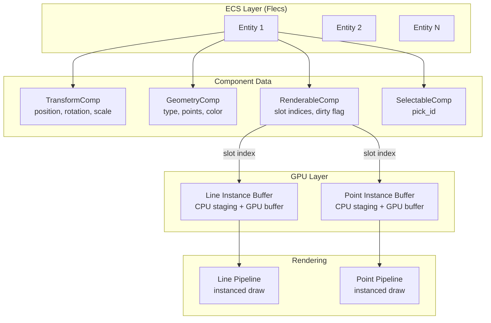

### Key Principles

1. **ECS for Logic**: Flecs manages entity lifecycle, component storage, and queries
2. **GPU Instancing for Rendering**: Template geometry is drawn once, instance data varies per entity
3. **CPU Staging Buffers**: All instance data lives in CPU memory, uploaded to GPU once per frame
4. **Slot-Based Allocation**: Each entity reserves slots in GPU buffers, tracked by `RenderableComp`

---

## Component Design

### Component Hierarchy

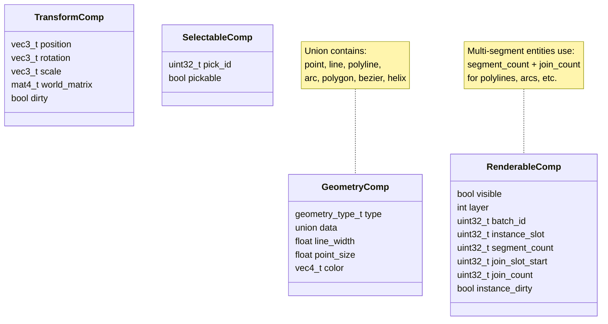

### Geometry Types

| Type | Segments | Joins | Description |
|------|----------|-------|-------------|
| `GEOM_POINT` | 0 | 0 | Single point (uses point buffer) |
| `GEOM_LINE` | 1 | 0 | Single line segment |
| `GEOM_POLYLINE` | N-1 | N-2 | Open path with N points |
| `GEOM_POLYGON` | N | N | Closed path with N points |
| `GEOM_ARC` | varies | varies | Tessellated to polyline |
| `GEOM_BEZIER` | varies | varies | Tessellated to polyline |
| `GEOM_HELIX` | varies | varies | Tessellated to polyline |

---

## GPU Buffer Management

### Instance Buffer Structure

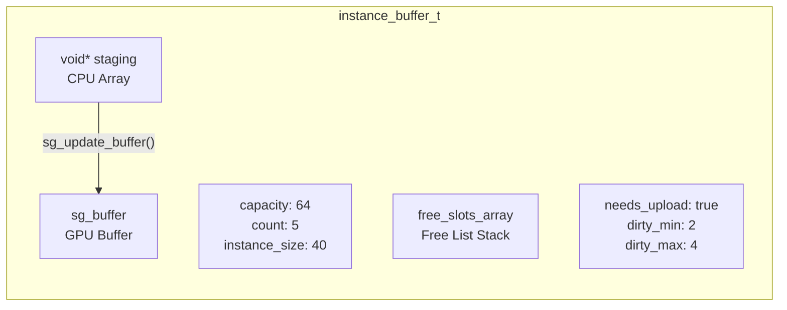

### Line Instance Data (40 bytes)

```c
typedef struct {
    float ax, ay, az;   // Point A (12 bytes)
    float bx, by, bz;   // Point B (12 bytes)
    float r, g, b, a;   // Color   (16 bytes)
} geom_line_instance_t;  // Total: 40 bytes
```

### Point Instance Data (28 bytes)

```c
typedef struct {
    float x, y, z;      // Center  (12 bytes)
    float r, g, b, a;   // Color   (16 bytes)
} geom_point_instance_t; // Total: 28 bytes
```

---

## Memory Layout

### Single-Slot Entities (Point, Line)

```
Line Instance Buffer (CPU staging):
┌─────────────────────────────────────────────────────────────┐
│ Slot 0 │ Slot 1 │ Slot 2 │ Slot 3 │ Slot 4 │ ... │ Slot 63 │
│ 40B    │ 40B    │ 40B    │ 40B    │ 40B    │     │ 40B     │
│ Line A │ Line B │ Line C │ (free) │ Line D │     │ (empty) │
└─────────────────────────────────────────────────────────────┘
         ▲                   ▲
         │                   │
    Entity "Line B"    Free list: [3]
    RenderableComp:
      instance_slot = 1
      segment_count = 1
```

### Multi-Slot Entities (Polyline, Arc, Polygon, etc.)

For a **polyline with 4 points** (3 segments, 2 joins):

```
Line Instance Buffer:
┌─────────────────────────────────────────────────────────────┐
│ Slot 0 │ Slot 1 │ Slot 2 │ Slot 3 │ Slot 4 │ Slot 5 │ ...  │
│ Line A │ Seg 0  │ Seg 1  │ Seg 2  │ Line B │ (free) │      │
└─────────────────────────────────────────────────────────────┘
         ├────────────────────┤
              Polyline P
              (contiguous!)

Point Instance Buffer:
┌─────────────────────────────────────────────────────────────┐
│ Slot 0 │ Slot 1 │ Slot 2 │ Slot 3 │ Slot 4 │ ...           │
│ Pt A   │ Join 0 │ Join 1 │ Pt B   │ (free) │               │
└─────────────────────────────────────────────────────────────┘
         ├─────────────┤
           Polyline P joins
           (contiguous!)

Entity "Polyline P" RenderableComp:
  instance_slot = 1      (first segment slot)
  segment_count = 3
  join_slot_start = 1    (first join slot)
  join_count = 2
```

### Why Contiguous Allocation Matters

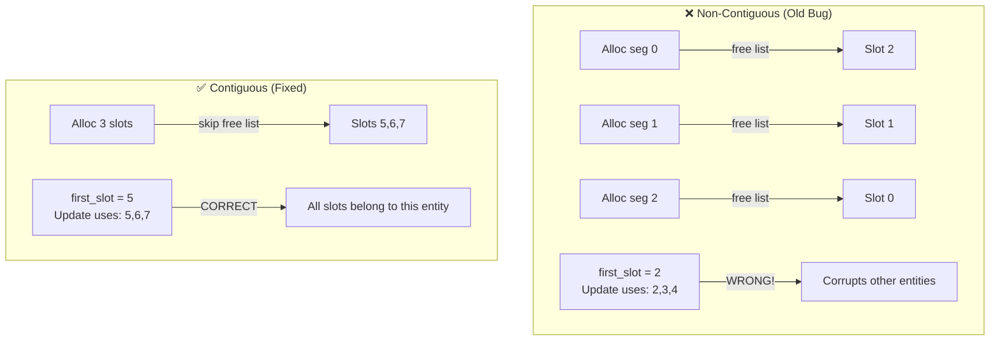

---

## Slot Allocation Strategy

### Allocation Functions

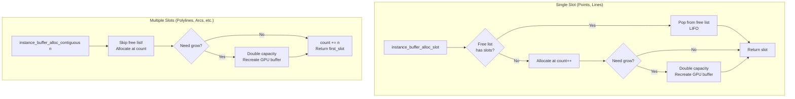

### Free List Behavior (LIFO Stack)

```
Initial state: count=6, free_slots=[]

Delete entity at slot 2:
  free_slots = [2], free_count = 1

Delete entity at slot 4:
  free_slots = [2, 4], free_count = 2

Allocate single slot:
  Returns 4 (LIFO pop), free_slots = [2], free_count = 1

Allocate single slot:
  Returns 2 (LIFO pop), free_slots = [], free_count = 0

Allocate single slot:
  Returns 6 (new slot), count = 7
```

---

## Dirty Flag System

### Two-Level Dirty Tracking

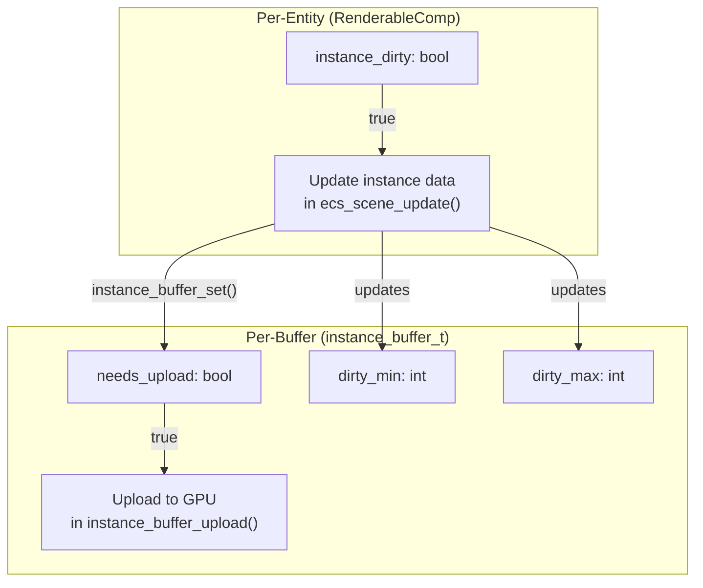

### Dirty Flag Flow

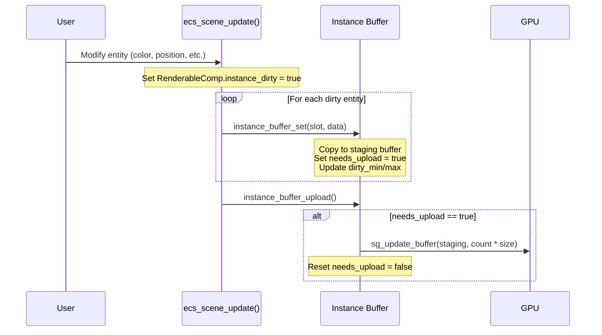

### What Triggers Dirty?

| Action | Sets `instance_dirty` | Sets `needs_upload` |
|--------|----------------------|---------------------|
| Entity created | Initially `false`* | `true` (via `_set()`) |
| Color changed | `true` | (after update) |
| Transform changed | `true` | (after update) |
| Visibility toggled | `true` | (after update) |
| Hover state changed | `true` | (after update) |
| Selection changed | `true` | (after update) |
| Slot freed | N/A | `true` (zeros data) |

*Entity creation sets data directly, then sets `instance_dirty = false` since data is already in staging buffer.

---

## Rendering Pipeline

### GPU Instancing Concept

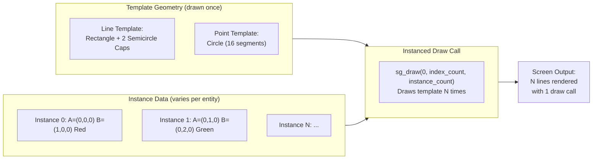

### Vertex Shader: Screen-Space Width

The vertex shader transforms the template geometry to achieve **constant screen-space width**:

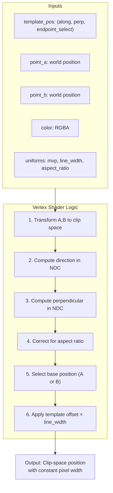

### Frame Rendering Flow

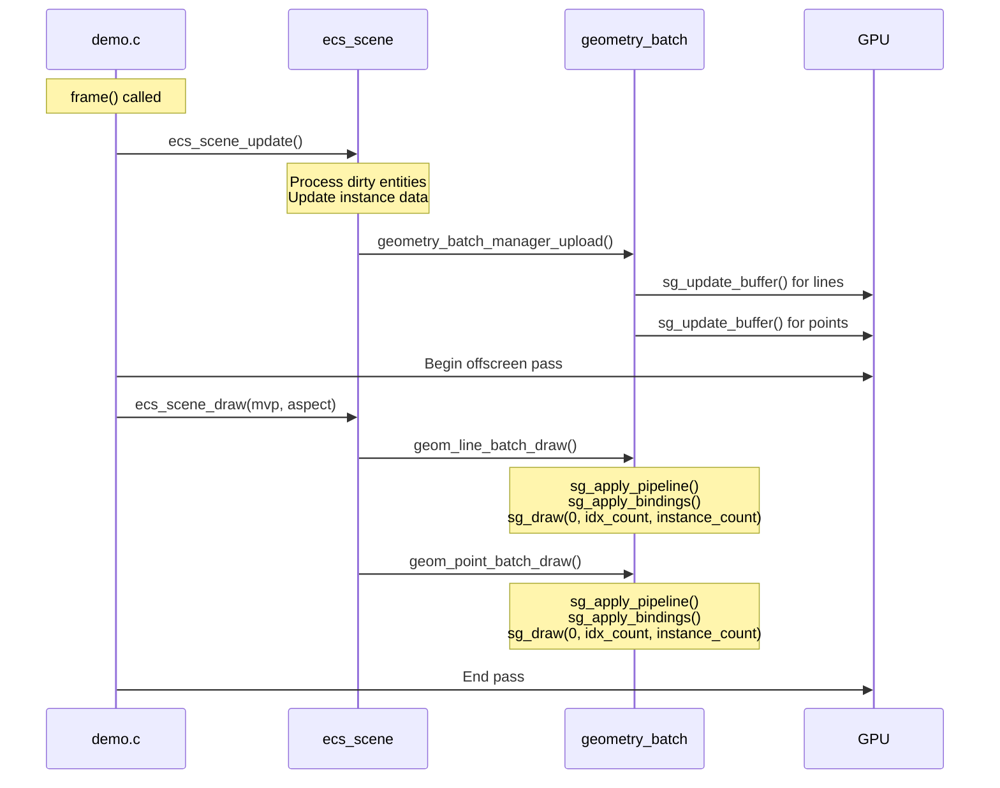

---

## Examples: Entity Lifecycle

### Example 1: Adding a Point

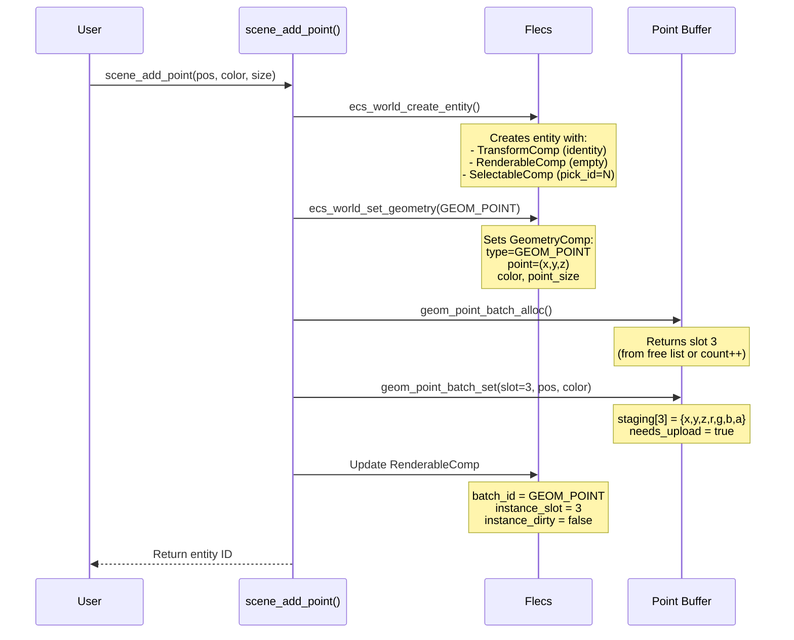

**Memory State After:**

```
Point Instance Buffer:
┌────────┬────────┬────────┬─────────────┬────────┐
│ Slot 0 │ Slot 1 │ Slot 2 │ Slot 3      │ Slot 4 │
│ Pt X   │ Pt Y   │ (free) │ NEW POINT   │ (empty)│
│        │        │        │ x,y,z,r,g,b,a│        │
└────────┴────────┴────────┴─────────────┴────────┘
                            ▲
                            │
                    Entity's slot

Buffer metadata:
  count = 4 (if slot 3 was new)
  needs_upload = true
  dirty_min = 3, dirty_max = 3
```

---

### Example 2: Adding a Line

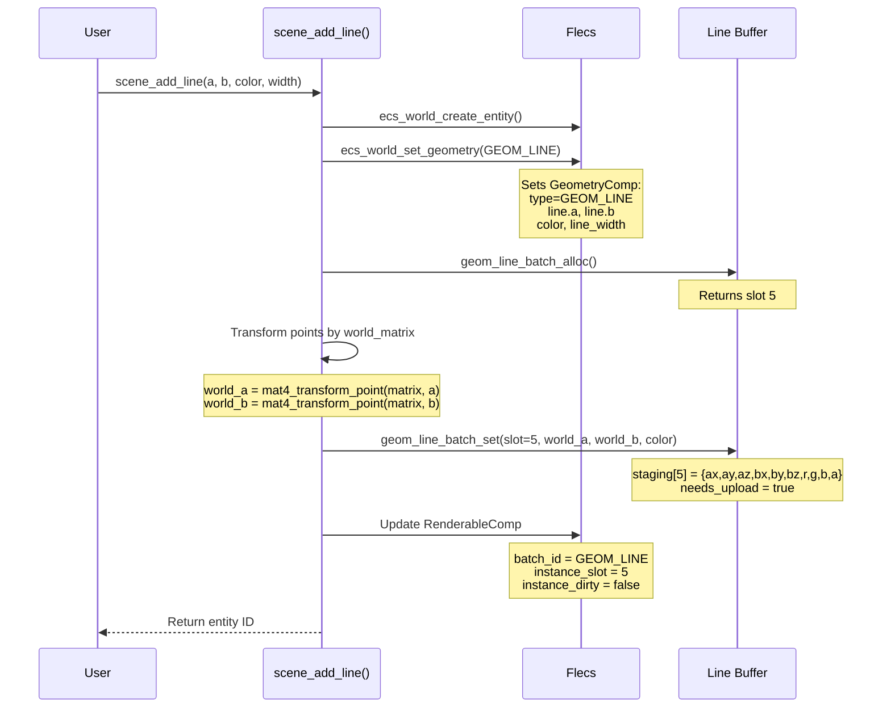

**Memory State After:**

```
Line Instance Buffer (40 bytes per slot):
┌──────────────────────────────────────────────────────────────────┐
│ Slot 0    │ Slot 1    │ ... │ Slot 5                   │ Slot 6 │
│ Line X    │ Line Y    │     │ NEW LINE                 │ (empty)│
│           │           │     │ ax,ay,az,bx,by,bz,r,g,b,a│        │
└──────────────────────────────────────────────────────────────────┘
                               ▲
                               │
                       Entity's instance_slot = 5
```

---

### Example 3: Adding an Arc (Multi-Segment)

An arc with `start_angle=0`, `end_angle=π/2` (quarter circle) tessellates to ~7 points → 6 segments + 5 joins.

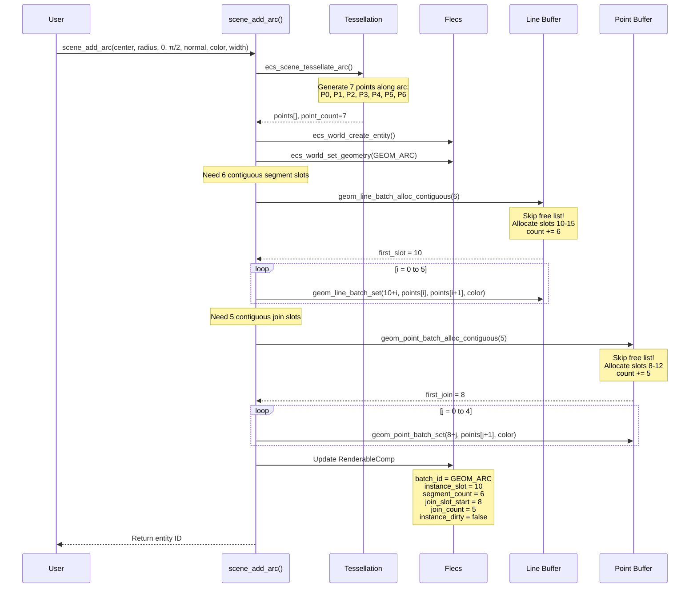

**Memory State After:**

```
Line Instance Buffer:
┌─────────────────────────────────────────────────────────────────────────────┐
│ ... │ Slot 10   │ Slot 11   │ Slot 12   │ Slot 13   │ Slot 14   │ Slot 15   │
│     │ P0→P1     │ P1→P2     │ P2→P3     │ P3→P4     │ P4→P5     │ P5→P6     │
│     ├───────────┴───────────┴───────────┴───────────┴───────────┴───────────┤
│     │                    Arc Entity (6 contiguous segments)                  │
└─────────────────────────────────────────────────────────────────────────────┘

Point Instance Buffer:
┌───────────────────────────────────────────────────────────────────┐
│ ... │ Slot 8    │ Slot 9    │ Slot 10   │ Slot 11   │ Slot 12    │
│     │ Join @P1  │ Join @P2  │ Join @P3  │ Join @P4  │ Join @P5   │
│     ├───────────┴───────────┴───────────┴───────────┴────────────┤
│     │              Arc Entity (5 contiguous joins)                │
└───────────────────────────────────────────────────────────────────┘

Arc Entity RenderableComp:
  instance_slot = 10     (first segment in line buffer)
  segment_count = 6
  join_slot_start = 8    (first join in point buffer)
  join_count = 5
```

---

### Example 4: Deleting an Entity

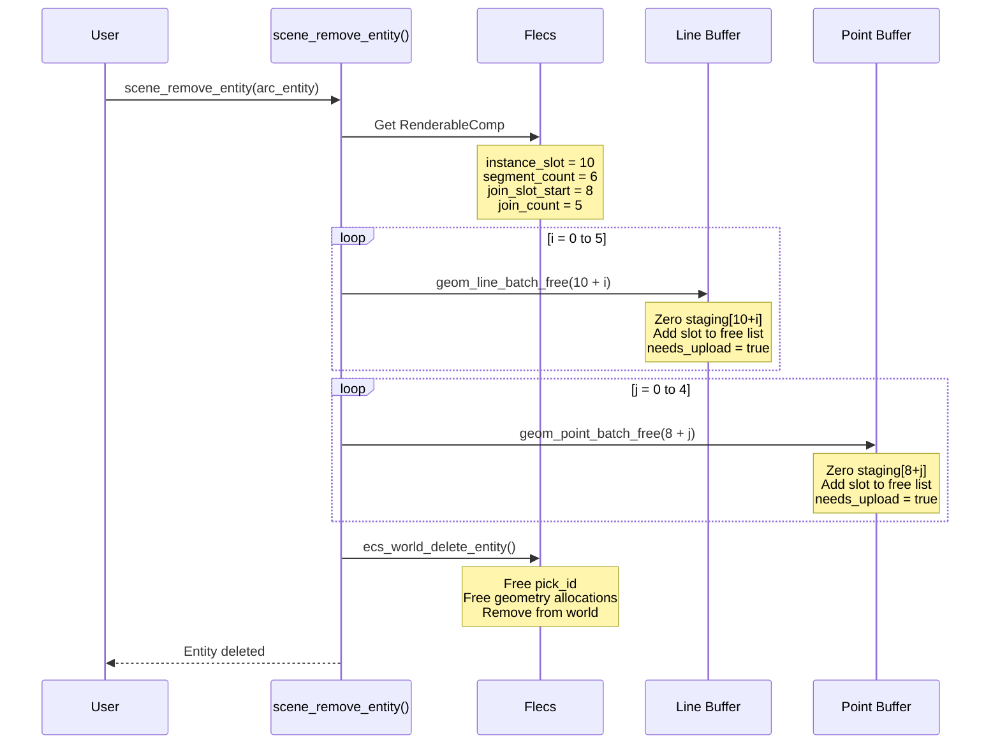

**Memory State After Deletion:**

```
Line Instance Buffer:
┌─────────────────────────────────────────────────────────────────────────────┐
│ ... │ Slot 10   │ Slot 11   │ Slot 12   │ Slot 13   │ Slot 14   │ Slot 15   │
│     │ (zeroed)  │ (zeroed)  │ (zeroed)  │ (zeroed)  │ (zeroed)  │ (zeroed)  │
└─────────────────────────────────────────────────────────────────────────────┘

Free list (LIFO): [10, 11, 12, 13, 14, 15, ...]
                   ▲
                   Next single-slot alloc gets 15

Point Instance Buffer:
┌───────────────────────────────────────────────────────────────────┐
│ ... │ Slot 8    │ Slot 9    │ Slot 10   │ Slot 11   │ Slot 12    │
│     │ (zeroed)  │ (zeroed)  │ (zeroed)  │ (zeroed)  │ (zeroed)   │
└───────────────────────────────────────────────────────────────────┘

Free list (LIFO): [8, 9, 10, 11, 12, ...]
```

---

## Performance Characteristics

### Why This Design is Fast

| Technique | Benefit |
|-----------|---------|
| **GPU Instancing** | Thousands of lines rendered in 1 draw call |
| **CPU Staging Buffer** | Batch updates before single GPU upload |
| **Dirty Tracking** | Only update modified entities |
| **Contiguous Slots** | Sequential memory access, cache-friendly |
| **Free List Recycling** | No memory fragmentation for single-slot entities |

### Complexity Analysis

| Operation | Time Complexity | Notes |
|-----------|-----------------|-------|
| Add single entity | O(1) | Amortized (may trigger resize) |
| Add N-segment entity | O(N) | Set N instance slots |
| Delete entity | O(1) or O(N) | Single vs multi-segment |
| Update dirty entities | O(dirty count) | Per-frame |
| GPU upload | O(total count) | Full buffer upload |
| Draw call | O(1) | Single instanced draw |

### Memory Usage

```
Line buffer: count × 40 bytes (+ staging copy)
Point buffer: count × 28 bytes (+ staging copy)

Example: 1000 lines + 500 points + 10 arcs (60 segments, 50 joins)
  Lines: (1000 + 60) × 40 = 42,400 bytes
  Points: (500 + 50) × 28 = 15,400 bytes
  Total GPU: ~58 KB (×2 for staging = ~116 KB)
```

---

## File Reference

| File | Purpose |
|------|---------|
| `src/gpu/instance_buffer.h` | Slot allocation, staging, upload |
| `src/gpu/geometry_batch.h` | Batch manager, template geometry, pipelines |
| `src/ecs/ecs_world.h` | Flecs world, component registration |
| `src/ecs/ecs_scene.h` | High-level scene API, entity creation |
| `src/components/*.h` | Component definitions |
| `src/shaders/instanced_line_shaders.h` | Line vertex/fragment shaders |
| `src/shaders/join_shaders.h` | Point/join vertex/fragment shaders |

---

## Summary

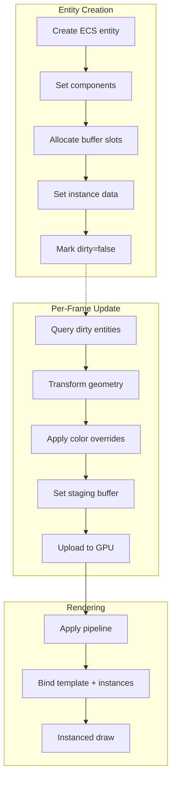

The key insight: **separate entity logic (ECS) from rendering data (GPU buffers)**, connected by slot indices stored in `RenderableComp`. This allows:

1. ECS to manage entity lifecycle without knowing GPU details
2. GPU buffers to be efficiently batched without knowing entity semantics
3. Dirty tracking to minimize per-frame work
4. Instancing to render thousands of primitives efficiently
